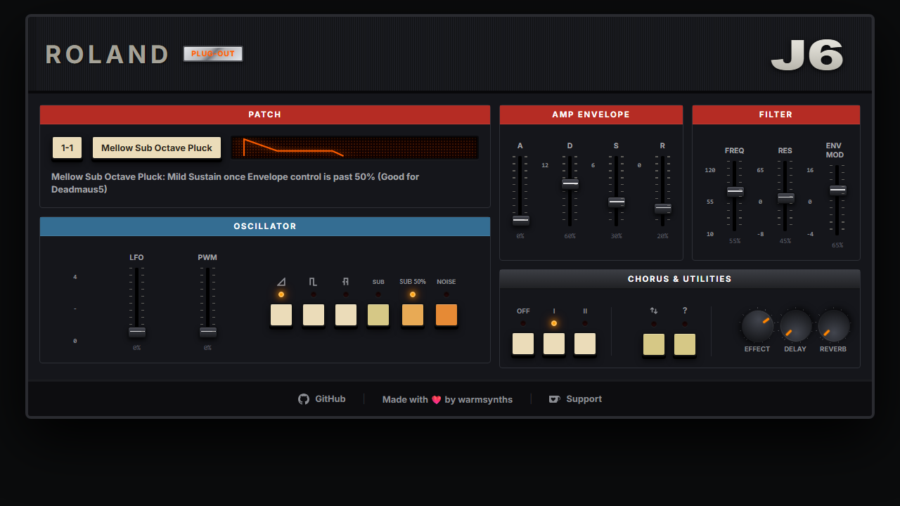

# Roland J-6 Preset Explorer



> Built from the work of Nick Standing and their compilation spreadsheet and video.
> See: https://www.youtube.com/watch?v=z6hoNwWadR8

A lightweight browser app for exploring and understanding Roland J-6 presets.

## What it does

This app makes it easier to search, filter, and inspect Roland J-6 patch data by combining:
- preset names and notes
- inferred producer-friendly tags
- waveform and envelope parameter summaries
- a visual amp envelope tracer for attack/decay/sustain/release

It is built as a static web app with modern web components and runs in the browser with Vite.

## Why it exists

The Roland J-6 has many preset descriptions that are not always easy to scan or compare quickly. This app helps by:
- surfacing preset patches in a searchable list
- inferring genre, instrument, character, waveform, and effects tags from notes and preset metadata
- visualizing envelope behavior in a simple left-to-right tracer animation
- keeping the UI focused on usable preset discovery rather than raw patch editing

## Key features

- Skeuomorphic retro synth UI design inspired by classic Roland instruments
- Text search across preset name, notes, waveform, filter, effects, and tags
- Category filters for:
  - Genre / Mood
  - Instrument / Type
  - Character
  - Envelope
  - Effects
  - Waveform
- Preset detail panel with:
  - patch ID and name
  - notes and tags
  - oscillator / filter / effect summaries
  - animated envelope visualizer

## Technical overview

### `src/j6-app.ts`

This is the main app shell.
- imports static preset data from `src/presets-data.js`
- infers additional tags from each preset using `inferTags()`
- manages application state for search and filters using Lit `@state`
- computes filtered presets in `get filteredPresets()`
- categorizes tag values with `getTagCategory()` so filter pickers are grouped logically
- renders the UI, including search, collapsible filters, `j6-preset-list`, and `j6-preset-detail`

### `src/j6-preset-list.ts`

A reusable Lit component that renders the preset selection panel.
- displays presets in a scrollable list
- supports mobile-style drawer collapse/expand
- highlights the selected preset
- emits `preset-selected` events when the user picks a patch

### `src/j6-preset-detail.ts`

Shows the selected preset details and envelope visualizer.
- renders preset metadata and tags
- draws an SVG envelope path from attack/decay/sustain/release values
- animates the envelope path using CSS `stroke-dasharray`, `stroke-dashoffset`, and `@keyframes`
- includes a neon glow pulse effect for the traced path

### `src/presets-data.js`

Contains the raw preset database as a static JavaScript export.
- each preset includes Roland J-6 fields such as `bankPatch`, `soundNameCategory`, `waveformOscType`, `attack`, `decay`, `sustain`, `release`, and `notesDescription`
- `j6-app.ts` maps this raw data into the app's expected property names and generates tag metadata

## Run locally

```bash
npm install
npm run dev
```

Then open the browser at the Vite dev server URL.

## Build for production

```bash
npm run build
npm run preview
```

## Notes

- The app is built with Lit 3 and TypeScript.
- `index.html` mounts `<j6-app>` and loads `src/j6-app.ts` as an ES module.
- The app is deliberately kept static and dependency-light for fast loading.
